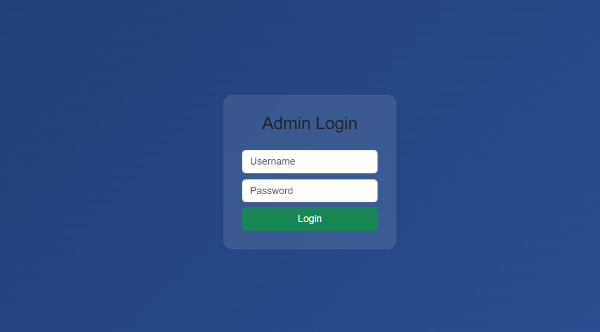
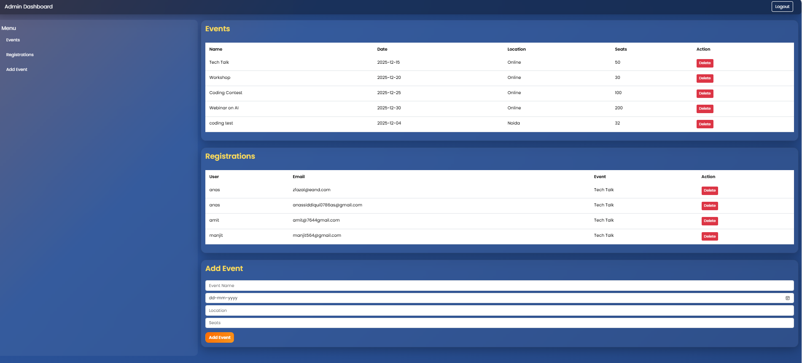
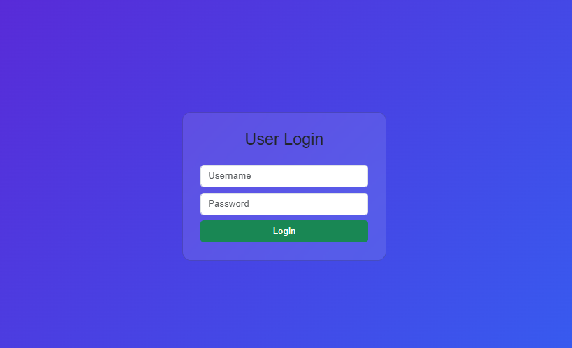
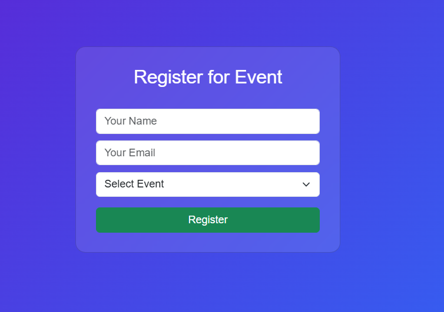
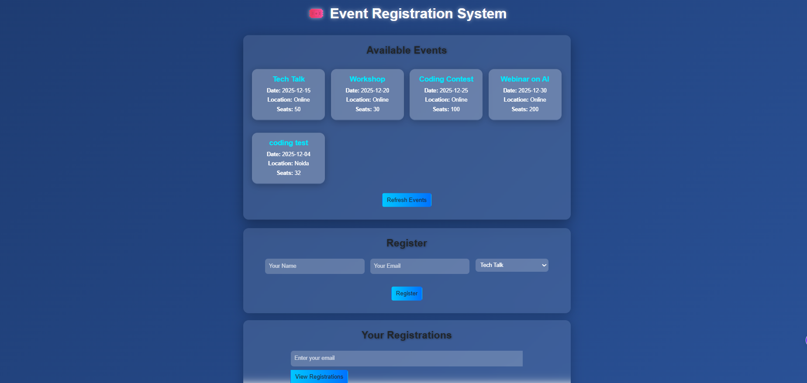

<<<<<<< HEAD
# Event Registration System

## Description
This is a web-based Event Registration System. Users can login and register for events. Admins can add, delete, and view events and registrations.

## Project Structure
codealpha_task1_event-registration/
├─ server.js
├─ package.json
├─ models/
│ ├─ event.js
│ └─ registration.js
├─ public/
│ ├─ admin-login.html
│ ├─ admin-dashboard.html
│ ├─ user-login.html
│ ├─ event-registration.html
│ └─ style.css
├─ screenshots/
│ ├─ admin-login.png
│ ├─ admin-dashboard.png
│ ├─ user-login.png
│ ├─ user-dashboard.png
│ └─ event-registration.png
└─ README.md

---

## Technologies Used
- Node.js  
- Express.js  
- MongoDB & Mongoose  
- HTML, CSS, JavaScript  
- Bootstrap 5  

---

## Installation & Setup

## How to Run  

1. **Clone the repository**  

git clone https://github.com/Anas-Siddiqui78/codealpha_task1.git

2. **Go to project folder**  
cd codealpha_task1_event-registration

3. **Install dependencies**  
npm install express mongoose body-parser cors

4. **Start MongoDB**  
- Make sure MongoDB is running locally:  

5. **Start the server**  
node server.js

6. **Open in browser**  
- Admin login: `http://localhost:5000/admin`  
- User login: `http://localhost:5000/user-login`  

---

## Usage

### Admin
- Login with credentials:  
  - **Username:** `admin`  
  - **Password:** `12345`  
- View, add, or delete events.  
- View all user registrations with exact date .

### User
- Login with credentials:  
  - **Username:** `user`  
  - **Password:** `12345`  
- Register for any available events.  
- View registered events in **user dashboard**.  

---

## Screenshots

- Admin Login:  
  

- Admin Dashboard:  
  

- User Login:  
  

- User Dashboard:  
  

- Event Registration Page:  
  

---

## Notes
- Make sure all HTML files are inside `public/` folder.  
- Make sure the `screenshots/` folder exists with PNG images for proper display in README.  
- Server runs on port `5000` by default, change in `server.js` if needed.

---

## License
This project is licensed under the **MIT License**.  
You are free to use, copy, and modify this project for personal or educational purposes.  

=======
# codealpha_task1
This is a web-based Event Registration System. Users can login and register for events. Admins can add, delete, and view events and registrations. This is my submission for CodeAlpha Task 1.
>>>>>>> 
